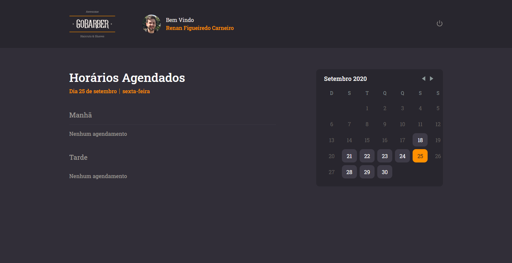
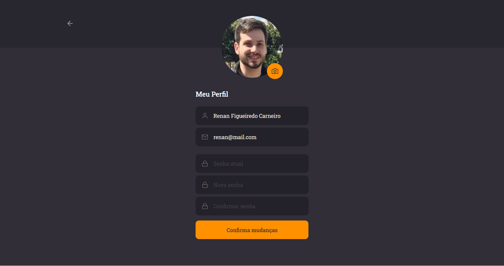

 
 :scissors: <h1> GoBarber Web </h1> :scissors: 

## About this project

Webpage used by providers to check appointments by date.

## Requirements

- [API](https://github.com/rnanc/gobarber-api)
- Node
- Yarn

## Installing

Run the following command:

`$ yarn`

and then:

`$ yarn start`
